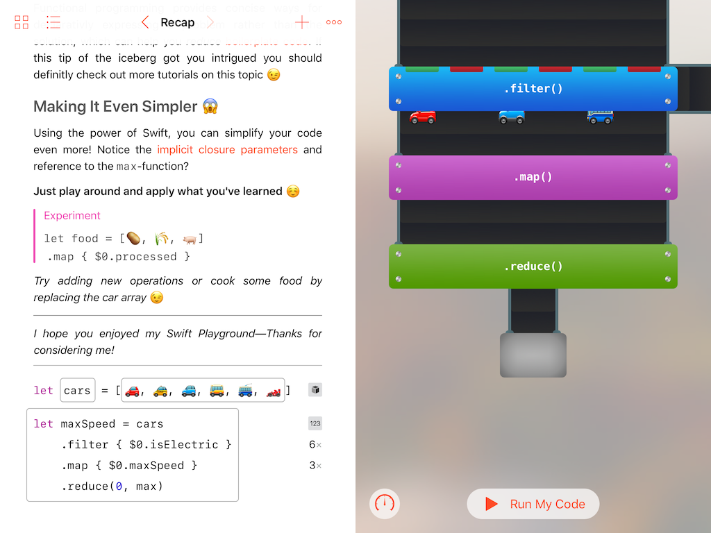

# Reduce

This is my 2017 _WWDC_ scholarship submission. See my [blog post](https://stoeffn.de/projects/reduce/) for reference :)

## Contents
The playground is divided into four pages: "Filter", "Map", "Reduce", and "Recap". On first three pages, the user learns how to use a new function and extends a little program to use it. The final page can be used to just fiddle around.

As you can see in the screenshot below, the live view reflects the code on the left, conveying its workings with umm... conveyors.

Every time the user hits "Run My Code", the live view is updated using the function method in the editable code area. This is to say, it is independent of the page as it allows arbitrary chaining of the three available methods. The array then "enters" the conveyor at the top, making its way down through various machines that perform an operation on each item.

## How It Works
As you might have guessed, I'm using a custom array. In order to hide its creation, I call a custom `visualized` extension that converts a regular array in a hidden code segment. Thus, I can use standard array literals (and make them editable) without exposing my custom type.

This custom type, `MachineArray`, is a proxy that performs its operation on the underlying array while also serializing the operation type and sending it to the live view for recreation. In a similar fashion, it also transmits the array items and changes after an operation.

The life view itself itself is made with `SpriteKit`, which was a pretty enjoyable learning experience.
